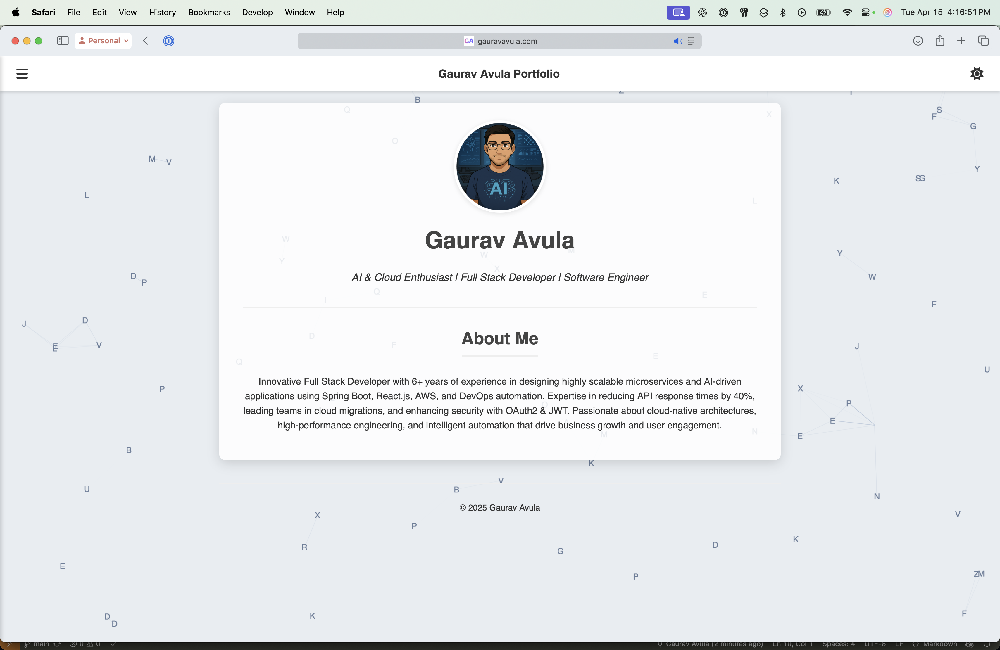
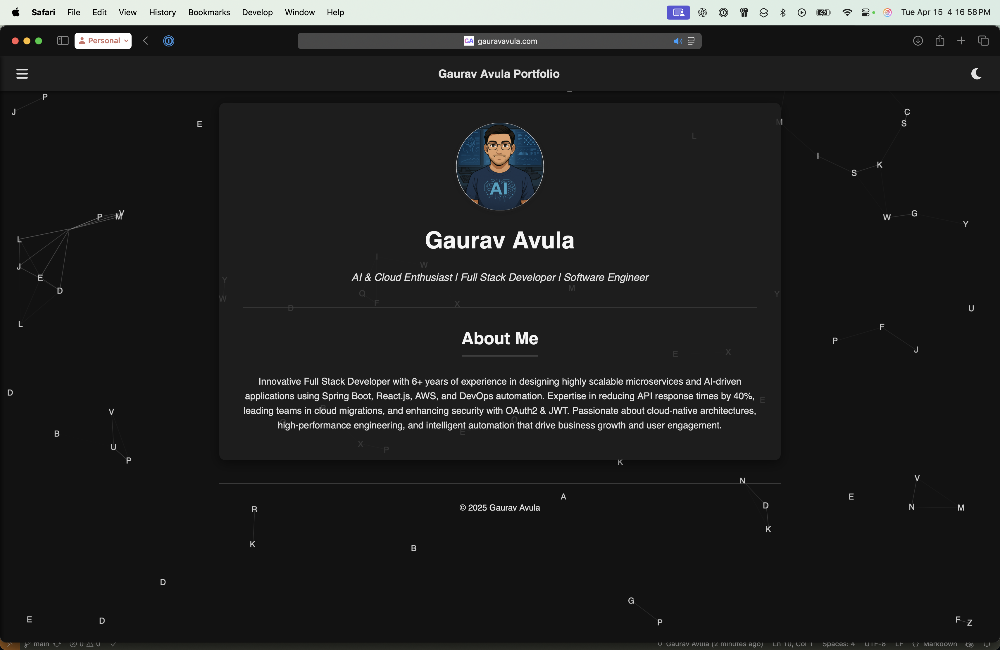
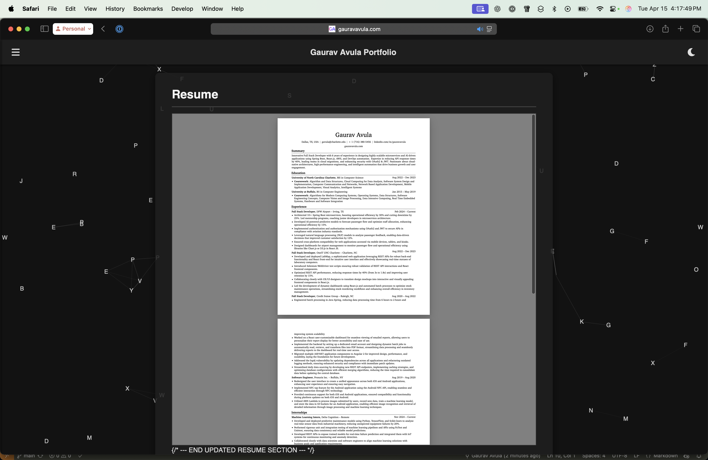

# Portfolio 

This project is a portfolio website showcasing a dynamic background animation and a resume. It includes a grid animation with interactive dots and lines, a side menu, and a theme toggle for light/dark modes. The resume is included as a PDF file.

## Features
- **Dynamic Background Animation**: Interactive grid with animated dots and lines.
- **Side Menu**: Responsive navigation menu.
- **Theme Toggle**: Switch between light and dark themes.
- **Resume Display**: Includes a downloadable PDF resume.

---

## 📸 Screenshots

#### 💻 Homepage (Light Mode)


#### 🌙 Homepage (Dark Mode)


#### 📄 Resume Section


> To update screenshots, place your images in the `screenshots/` folder and update the file names accordingly.

---

## Getting Started

Follow these instructions to set up and run the project locally.

### Prerequisites
- **Node.js**: Ensure you have Node.js installed. [Download Node.js](https://nodejs.org/)
- **Git**: Ensure Git is installed. [Download Git](https://git-scm.com/)

---

### Installation

1. **Clone the Repository**
   ```bash
   git clone https://github.com/gauravav/Portfolio.git
   cd Portfolio
   ```

2. **Install Dependencies**
   This project does not require any additional dependencies. All files are static and ready to use.

---

### Running the Project

1. **Open the Project**
   Open the `index.html` file in your browser to view the portfolio.

   ```bash
   open index.html
   ```

   Alternatively, you can use a live server for better development experience:
   ```bash
   npx live-server
   ```

2. **View the Resume**
   The resume is located in the `resume.pdf` file. You can download and view it directly.

3. **View Image**
    The image displayed on the website is being sourced from image.png file and free feel to update it accordingly.

---

### Modifying the Project

1. **Edit the Background Animation**
   - The background animation logic is in the `main.js` file.
   - Modify the grid animation settings, such as `maxSpeed`, `mouseConnectionRadius`, or `nodeConnectionRadius`, to customize the behavior.

2. **Update the Resume**
   - Replace the `resume.pdf` file with your own resume.
   - Ensure the file is named `resume.pdf` to maintain compatibility.

3. **Customize the Theme**
   - Edit the theme logic in `main.js` to add or modify light/dark theme styles.

4. **Modify the HTML**
   - Update the `index.html` file to change the structure or content of the portfolio.

---

### Folder Structure

```
portfolio/
├── index.html        # Main HTML
├── main.js           # Animation and theme toggle logic
├── lightTheme.js     # Light theme definitions
├── darkTheme.js      # Dark theme definitions
├── styles.css        # Main stylesheet
├── image.png         # Background image or profile pic
├── resume.pdf        # Embedded/downloadable resume
└── README.md         # Project documentation
```

---

### License

This project is open-source and available under the [MIT License](LICENSE).

---

### Contributing

Feel free to fork the repository and submit pull requests for improvements or new features.

---

### Contact

For any questions or suggestions, please contact [sudo@gauravavula.com].